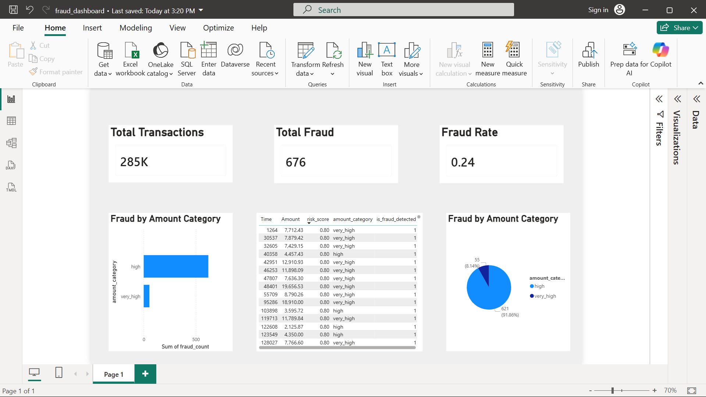

# 🔍 Fraud Detection Pipeline (Python + SQL + Power BI)

## 📌 Overview
An end-to-end data engineering project that processes 284,807 real financial transactions to detect fraudulent activity using a batch ETL pipeline, feature engineering, SQL analytics, and an interactive Power BI dashboard.

---

## 🔄 Data Pipeline Flow

```
creditcard.csv (Kaggle)
       │
       ▼
ingestion.py  ──►  Raw batch (5,000 rows at a time)
       │
       ├──►  load.py  ──►  raw_transactions (SQLite)
       │
       ▼
transform.py  ──►  Feature engineering + risk scoring
       │
       ▼
load.py  ──►  processed_transactions  (SQLite)
         ──►  fraud_alerts            (SQLite)
       │
       ▼
summary_report.py  ──►  fraud_summary.csv  ──►  Power BI Dashboard
```

---

## ⚙️ Tech Stack

- **Python** — Pandas, NumPy
- **SQL** — SQLite (3 table schema)
- **Power BI** — Interactive dashboard
- **Git & GitHub** — Version control

---

## 🧠 Features Engineered

| Feature | Description |
|---|---|
| `amount_category` | Bins transaction amount: low / medium / high / very_high |
| `amount_zscore` | Z-score of transaction amount within each batch |
| `anomaly_flag` | True if z-score exceeds threshold (default: 3) |
| `high_amount_flag` | True if amount > $2,000 |
| `velocity_flag` | True if 5-transaction rolling average > $1,500 |
| `risk_score` | Weighted score (0–1) combining all 4 flags |
| `is_fraud_detected` | Final label — True if risk_score > 0.5 |

---

## 🗄️ Database Schema (SQLite)

| Table | Contents |
|---|---|
| `raw_transactions` | Original unmodified data |
| `processed_transactions` | All 284,807 transactions with engineered features |
| `fraud_alerts` | Only 676 rows where `is_fraud_detected = True` |

---

## 📊 Dashboard Highlights



- **Total Transactions** — 284,807
- **Total Fraud Detected** — 676
- **Fraud Rate** — 0.24%
- **Fraud by Amount Category** — 91.86% in high, 8.14% in very_high
- **Top Risk Transactions** — Sorted by risk score (max 0.80)

---

## 📈 Key Insights

- Processed 284,807 transactions from Kaggle Credit Card Fraud dataset
- 676 transactions flagged as fraudulent (0.24% fraud rate)
- 91.86% of fraud occurred in high amount category ($1,000–$5,000)
- 8.14% of fraud occurred in very high amount category ($5,000+)
- Top fraudulent transactions had risk scores of 0.80
- Average risk score across all transactions: 0.0058

---

## 📂 Project Structure

```
Fraud-Detection-Dashboard/
│
├── Data/
│   ├── raw/
│   │   └── creditcard.csv         ← Kaggle dataset (not uploaded)
│   ├── exports/
│   │   ├── processed_transactions.csv
│   │   ├── fraud_alerts.csv
│   │   └── fraud_summary.csv
│   └── transactions.db            ← Auto-generated
│
├── Src/
│   ├── config.py
│   ├── ingestion.py
│   ├── transform.py
│   ├── load.py
│   ├── pipeline.py
│   ├── summary_report.py
│   └── export_data.py
│
├── SQL/
│   └── queries.sql
│
├── PowerBi/
│   └── fraud_dashboard.pbix
│
├── Screenshots/
│   └── dashboard.png
│
├── logs/
│   └── pipeline.log               ← Auto-generated
│
├── requirements.txt
├── .gitignore
└── README.md
```

---

## 🚀 How to Run

```bash
# 1. Install dependencies
pip install -r requirements.txt

# 2. Place dataset
# Put creditcard.csv inside Data/raw/

# 3. Run the pipeline
cd Src
python pipeline.py

# 4. Generate summary report
python summary_report.py

# 5. Export CSVs for Power BI
python export_data.py

# 6. Open Power BI dashboard
# Open PowerBi/fraud_dashboard.pbix in Power BI Desktop
```

---

## 📦 Dataset

[Credit Card Fraud Detection — Kaggle](https://www.kaggle.com/datasets/mlg-ulb/creditcardfraud)
- 284,807 transactions
- 492 actual fraud cases (0.17%)
- Features: Time, Amount, V1–V28 (PCA anonymized), Class

---

## 👤 Author

**Ayush Tyagi**
[LinkedIn](https://linkedin.com/in/ayushtyagi) · [GitHub](https://github.com/AyushTyagi09)
